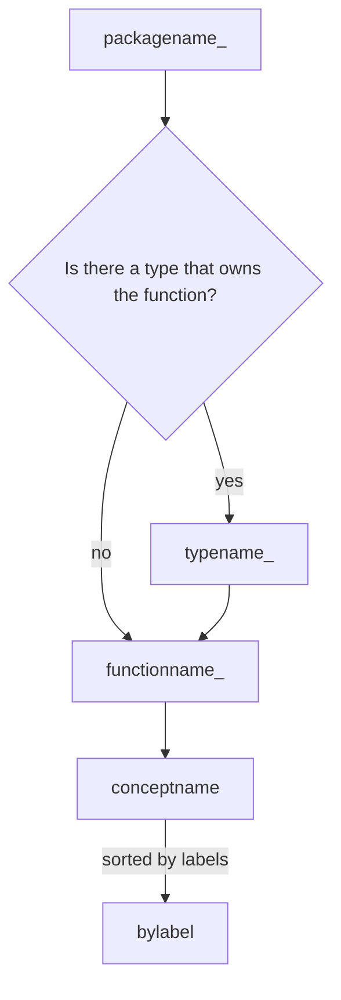

Andrew has two primary concepts: the Server and the Page.

The Server owns:
* answering questions about the layout of files in the directory structure
* understanding the kinds of file that are being served
* serving those files
If you are answering a question about files, the Server's got the answers. The server creates Pages
and serves those Pages.


The Page owns the content and metadata.

Page tracks the content of a specific file and various pieces of metadata about it.

For example, the page parses the contents of a file and parses out the andrew metadata headers, so that when the Server wants to present those elements to an end-user they're already built.


# Metric Names
Andrew exposes [prometheus](https://prometheus.io/docs/guides/go-application/) metrics, serving on /metrics.

The naming scheme is case-preserving.

The scheme is:



## definitions
packagename_ : the name of the package containing the function, followed by an underscore e.g. andrew_
typename_ : the name of the type which owns the function being instrumented e.g. AndrewServer_. If the function is owned by a package without an associated type, skip this.
functionname_ : the name of the function being instrumented, followed by an underscore e.g. Serve_
conceptname: what conceptually are we instrumenting here? For example, in the code below we are instrumenting noises.
bylabel: 
```
package roflcopter

import (
    "github.com/prometheus/client_golang/prometheus/promauto"
    "github.com/prometheus/client_golang/prometheus"
)

func noise(noiseType string) {
    switch noiseType {
    case "soisoisoi":
        promauto.NewCounter(prometheus.CounterOpts{
            Name: "roflcopter_noise_soisoisoi",
            Help: "The total number of soisoisoi noises the roflcopter made",
        }).Inc()
    case "explosion"
        promauto.NewCounter(prometheus.CounterOpts{
            Name: "roflcopter_noise_explosion",
            Help: "The total number of explosion noises the roflcopter made",
        }).Inc()
    default:
        // Handle unknown noise types if needed
        promauto.NewCounter(prometheus.CounterOpts{
            Name: "roflcopter_noise_unknownnoise",
            Help: "The total number of unknown noises the roflcopter made",
        }).Inc()
    }
}

```